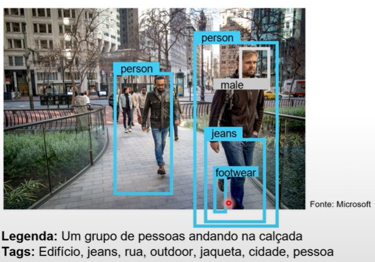

# Análise de imagem 4.0 com o AI Vision Service

Os recursos incluem:

- Personalização do modelo
- Ler texto de imagens
- Detecte pessoas em imagens
- Gerar legendas de imagens
- Detectar objetos
- Marcar recursso visuais
- Corte inteligente

## Detectando rostos com o face service

__Qualquer pessoa pode usar o serviço Face para detectar:__

- Desfoque: quão desfocado está o rosto.
- Exposição: aspectos como ruído: refere-se ao ruído na imagem.
- Óculos: se a pessoa estiver usando óculos.
- Pose da Cabeça: a orientação do rosto em um espaço 3D.
- Ruído: refere-se ao ruído visual na imagem.
- Oclusão: determina se pode haver objetos bloqueando o rosto na imagem.

__Somente clientes gerenciados da Microsoft podem acessar o recurso de reconhecimento facial:__

- Correspondência de similaridade
- Verificação de identidade

## Lendo texto com reconhecimento óptico de caracteres (OCR)

__Detectar a localização do texto:__

- Impresso
- Escrito a mão
- Opções para extração rápida de texto de imagens ou análise assíncrona de documentos digitalizados maiores.

## DP Vision Service

- Análise de Face

1. [Azure Ai Services](https://portal.vision.cognitive.azure.com/gallery/featured)
2. Face
3. Detect faces in an image
4. Please select a resource
5. Create a new resource
6. Choose a name
7. Price Tier: S0
8. Create Resource
9. Selecionar a caixa do recurso: Try it out
10. Tirar uma foto ou fazer upload

- Análise de Documentos

1. [Azure Ai Services](https://portal.vision.cognitive.azure.com/demo/extract-text-from-images)
2. Extract Text From Image
3. Tirar uma foto ou fazer upload

- Add Captions to Images

1. [Azure Ai Services](https://portal.vision.cognitive.azure.com/demo/extract-text-from-images)
2. Add Captions to Images
3. Tirar uma foto ou fazer upload

