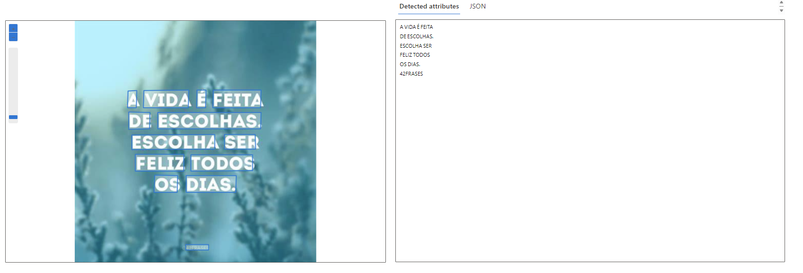

# Planejar uma solução de IA generativa responsável

As quatros fases do processo para desenvolver e implementar um plano de IA responsável são:

- Identificar
- Medida
- Mitigar
- Operar

## DP

1. Abrir o Azure Vision Studio
2. Selecionar Extract text from images
3. Fazer o Upload das imagens

